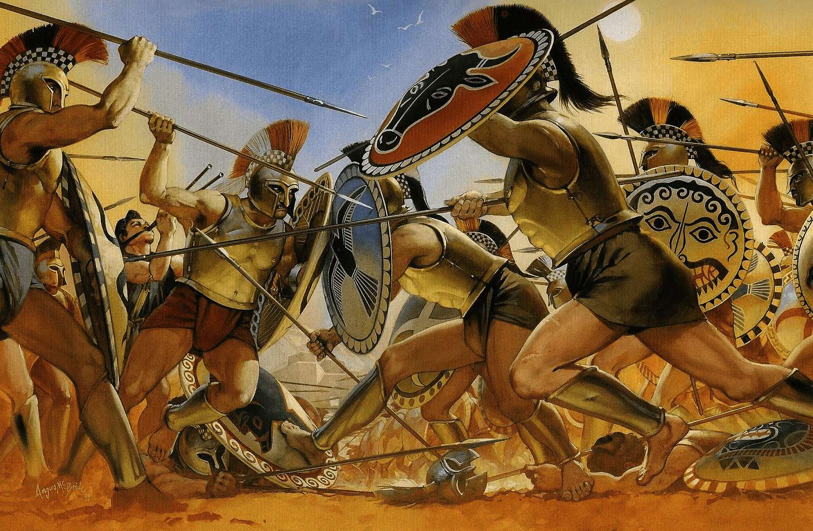

# Battle of Champions

<div style="text-align:center;"></div>

In 546 BC, nearly a century before the events which inspired the comic-turned-film "300", a blood-spilling battle was fought between Sparta and Argos.

After Spartan forces took control of the plain of Thyrea, an agreement was reached between the two armies that would limit losses during battle. Each side would send 300 champions to represent them, and no outside forces could assist. The rules were simple. This would be a fight-to-the-death, winner-takes-all battle. It became known as the Battle of Champions.

Having an equal number of champions, it was a very close fight. After fighting all day and all night, and believing that the Spartans had been decisively defeated, two surviving Argives, Alkenor and Chromios, returned home, claiming victory.

However, an injured Spartan, Othryades, was left for dead on the battlefield. Believing himself to be the sole survivor, he too claimed victory. Shortly afterwards he killed himself — possibly due to the shame of being the only survivor — but his claim of victory was heard.

The Argives were infuriated by the proclamation of victory by the Spartans, and Argos swiftly responded by attacking Sparta with a truly massive force. Sparta bravely fought with all of their might, easily overwhelming the Argive forces and gaining control of Thyreatis.

## About This Project

This project is a fun take on the [Angular](https://angular.io/) tutorial [Tour of Heroes](https://angular.io/tutorial), with an ancient Greek twist.

## Live Demo

https://code.lucaseverett.dev/battle-of-champions

## Getting Started

Clone this repo:

```sh
git clone https://github.com/lucaseverett/battle-of-champions.git
```

Install NPM dependencies:

```sh
npm install
```

Start dev server:

```sh
npm start
```
